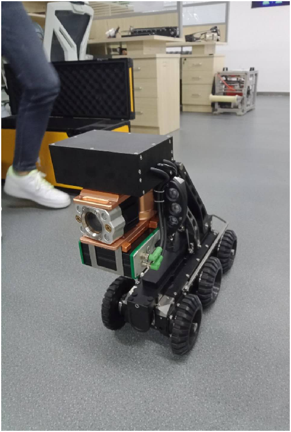
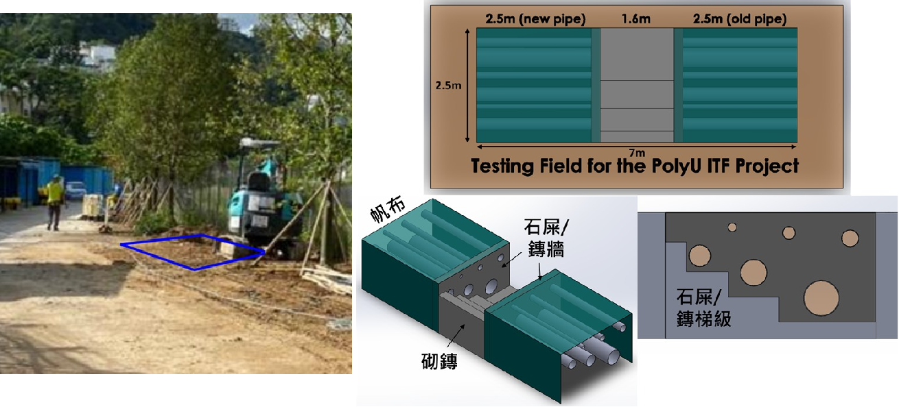
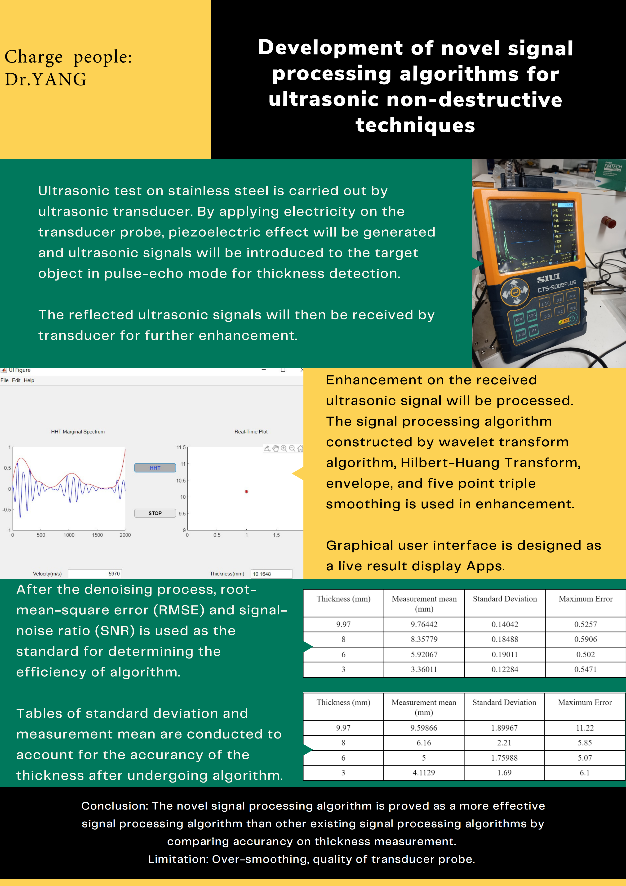

ProjectNic.github.io
Project Lists
1. ITF Project: “Development of Gas Pipe Diagnostic Technology by Nondestructive Thermographic and Ultrasonic Methods”
(PRP/014/19FX, ZM34) | Core Member | 2021-2022, PolyU

Responsibilities
Developed algorithms and designed a GUI for the ultrasound inspection component of the project.
Highlights
Advanced ultrasonic signal processing techniques for defect detection.
Integrated thermographic and ultrasonic diagnostics for gas pipe evaluation.
Visuals

     

Related Paper
"Yang, F., Shi, D., Lo, L. Y., Mao, Q., Zhang, J., & Lam, K. H,"
"Auto-Diagnosis of Time-of-Flight for Ultrasonic Signal Based on Defect Peaks Tracking Model," Remote Sensing, Jan. 2023 (Impact Factor = 5).

🔗 Read the Paper Here

2. Freezer Truck Development Project
(Prof. Ka Wai Eric Cheng, 2023, PolyU)

Project Title
智能冷藏車發展計劃 - 電力、太陽能和智能物流和存儲方法

Funding
4.934 Million HKD

3. AI-Based Environmental Perception System for Indoor Health Monitoring
HKSTP Pre-incubation Programme (IDEATION)

Duration
2023.05.11 - 2024.05.31

Core Members
Yang, F.
Mao Qian
Funding
100,000 HKD

Contribute to the Project
If you're interested in these projects or have ideas to collaborate, feel free to fork this repository or reach out!

Funding:
100,000 HKD

Get Involved
If you're interested in these projects or would like to contribute, feel free to reach out or fork this repository!
